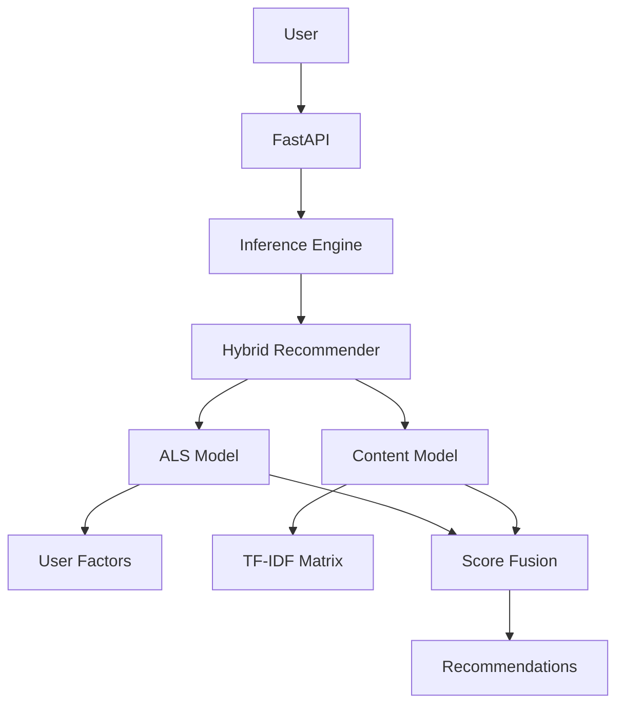

# Hybrid Recommendation System for E-Commerce

## Overview

This project is a production-oriented recommendation service built from the RetailRocket e-commerce dataset. It combines complementary signals to recommend products for known users while retaining a popular-item fallback for cold-start traffic.

The system uses ALS collaborative filtering to learn user and item latent factors from interaction history, TF-IDF content-based filtering to retrieve related products from item attributes, and a hybrid weighted-fusion strategy to combine both ranked candidate sets. The service is exposed through FastAPI and packaged for Docker deployment.

## Architecture



## Project Structure

```text
api/          FastAPI application, routes, and request/response schemas
src/          Application package: data, inference, utilities, and model code
src/models/   ALS, content-based, and hybrid recommender implementations
artifacts/    Serialized inference assets, weights, and popular-item fallback
configs/      Model, data, and deployment configuration
tests/        Unit and API test suite
evaluation/   Offline metrics and evaluation reports
notebooks/    Exploratory analysis and model-development notebooks
deployment/   Service integration and deployment support code
```

## ML Pipeline

```text
Data preprocessing
        ↓
Feature engineering
        ↓
ALS training
        ↓
Content model training
        ↓
Hybrid fusion
        ↓
Inference API
```

## Model Details

### ALS collaborative filtering

- Learns 64-dimensional latent factors for users and items.
- Uses historical implicit interaction patterns to surface products that similar users engage with.

### Content-based filtering

- Represents product information with TF-IDF features.
- Uses a 50,000-feature vocabulary and cosine similarity to identify related products.

### Hybrid recommendation

- Normalizes model scores and applies weighted score fusion.
- Default ALS weight: `0.5`.
- Default content weight: `0.5`.

## Evaluation Results

| Metric | Result |
| --- | ---: |
| Precision@10 | 0.0100 |
| Recall@10 | 0.1000 |
| Hit Rate@10 | 0.1000 |
| Catalog Coverage | 0.0016 |

## API Documentation

### `GET /api/v1/recommend/{user_id}`

Returns up to `top_n` hybrid recommendations for a known user, or the popular-item fallback when the user is unknown.

```bash
curl "http://localhost:8000/api/v1/recommend/123?top_n=2"
```

```json
{
  "user_id": 123,
  "recommendations": [
    {"item_id": 456, "score": 0.8721, "source": "Hybrid"},
    {"item_id": 789, "score": 0.8014, "source": "Hybrid"}
  ]
}
```

Interactive OpenAPI documentation is available at `http://localhost:8000/docs`.

## Local Setup

```bash
git clone <repository-url>
cd Hybrid-Recommendation-System
pip install -r requirements.txt
pytest tests/
uvicorn api.app:app --reload
```

Before testing or serving, provision the compatible model artifacts and processed mappings using the project's approved artifact store. They are intentionally excluded from source control.

## Docker Deployment

Build and run the service image:

```bash
docker build -t hybrid-recommendation-system .
docker run --rm -p 8000:8000 hybrid-recommendation-system
```

For the configured service, read-only artifact/config/data mounts, and health check:

```bash
docker-compose up --build
```

See [deployment documentation](docs/deployment.md) for artifact-management guidance.

## Future Improvements

- Online learning from new interaction events.
- User embeddings enriched with session and behavioral signals.
- Deep-learning recommender architectures for richer ranking.
- A real-time feature store for low-latency personalization.
- Managed cloud deployment with observability and autoscaling.
