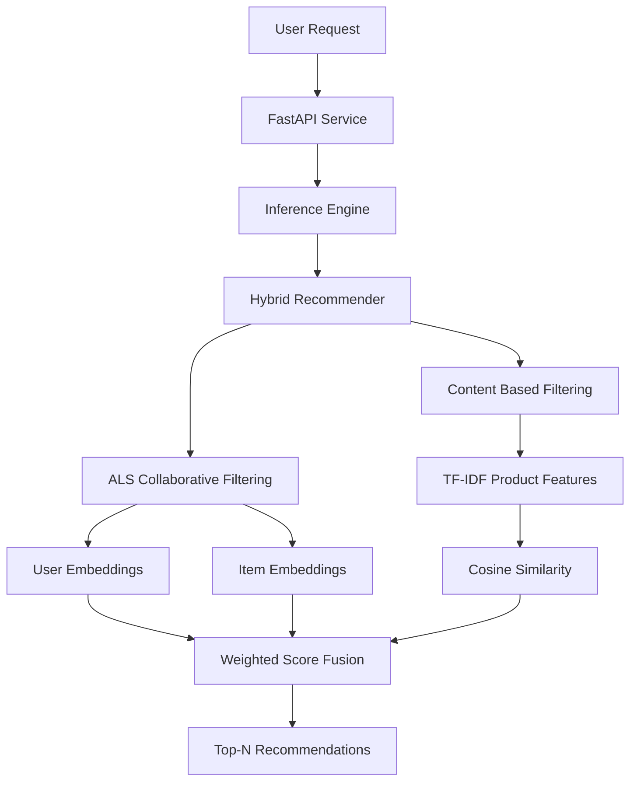

# Hybrid Recommendation System for E-Commerce

## Overview

This project is an end-to-end hybrid recommendation service built using the **RetailRocket e-commerce dataset**.

The system combines multiple recommendation approaches to generate personalized product recommendations for users:

- **Collaborative Filtering** using ALS (Alternating Least Squares)
- **Content-Based Filtering** using TF-IDF similarity
- **Hybrid Recommendation Engine** using weighted score fusion
- **Cold-start recommendation fallback** using popular-item recommendations

The recommendation engine is deployed as a REST API using **FastAPI** and packaged using **Docker** for reproducible deployment.

---

# Architecture



---

# Project Structure

```text
Hybrid-Recommendation-System/

├── api/
│   ├── app.py
│   ├── routes.py
│   └── schemas.py
│
├── src/
│   ├── inference/
│   ├── models/
│   │   ├── als/
│   │   ├── content/
│   │   └── hybrid/
│   └── utils/
│
├── artifacts/
│   Serialized model artifacts and inference assets
│
├── configs/
│   Model and deployment configuration
│
├── tests/
│   Unit and API test suite
│
├── evaluation/
│   Offline evaluation metrics
│
├── notebooks/
│   Exploratory analysis and experimentation
│
├── deployment/
│   Deployment-related configuration
│
├── Dockerfile
├── docker-compose.yml
├── requirements.txt
└── README.md
```

---

# ML Pipeline

```text
RetailRocket Dataset

        ↓

Data preprocessing

        ↓

User-item interaction matrix

        ↓

ALS Collaborative Filtering

        ↓

Content Feature Engineering

        ↓

TF-IDF Similarity Model

        ↓

Hybrid Score Fusion

        ↓

FastAPI Inference Service

        ↓

Product Recommendations
```

---

# Model Details

## ALS Collaborative Filtering

The collaborative filtering component uses **Alternating Least Squares** to learn latent user and item representations.

Configuration:

- Latent factors: `64`
- Regularization: `0.1`
- Iterations: `20`

The model learns from implicit user-item interactions such as:

- Product views
- Add-to-cart events
- Transactions

---

## Content-Based Filtering

The content model recommends products based on item similarity.

Approach:

- Product attributes converted into TF-IDF vectors
- Cosine similarity used for finding similar products
- Supports item-based recommendations

For users without available interaction history:

```
User ID
   ↓
ALS seed item
   ↓
Content similarity search
   ↓
Similar product recommendations
```

---

## Hybrid Recommendation Engine

The hybrid model combines ALS and content recommendations using weighted score fusion.

Default weights:

```
ALS Weight       : 0.5
Content Weight   : 0.5
```

The final ranking combines:

- Collaborative preference signals
- Product similarity signals

---

# Cold Start Handling

The system supports unknown users.

For new users:

```
Unknown User
      ↓
Popular Item Ranking
      ↓
Recommendation List
```

This ensures recommendations are still available when user history is unavailable.

---

# Evaluation Results

| Metric | Result |
|---|---:|
| Precision@10 | 0.0100 |
| Recall@10 | 0.1000 |
| Hit Rate@10 | 0.1000 |
| Catalog Coverage | 0.0016 |

---

# API Documentation

Interactive Swagger documentation:

```
http://localhost:8000/docs
```

---

## Health Check

### Endpoint

```
GET /api/v1/health
```

Response:

```json
{
  "status": "healthy",
  "models_loaded": true
}
```

---

## Hybrid Recommendation

### Endpoint

```
GET /api/v1/recommend/{user_id}
```

Returns personalized hybrid recommendations for known users.

Example:

```bash
curl "http://localhost:8000/api/v1/recommend/1150086?top_n=10"
```

Response:

```json
{
  "user_id":1150086,
  "model_used":"HybridRecommender",
  "recommendations":[
    {
      "item_id":143866,
      "score":0.5,
      "source":"Hybrid"
    },
    {
      "item_id":87413,
      "score":0.5,
      "source":"Hybrid"
    }
  ]
}
```

---

## ALS Recommendation

### Endpoint

```
POST /api/v1/recommend/als
```

Generates recommendations using collaborative filtering.

---

## Content Recommendation

### Endpoint

```
POST /api/v1/recommend/content
```

Uses:

- User interaction history when available
- ALS generated seed item when history is unavailable

---

# Running Locally

Clone repository:

```bash
git clone <repository-url>

cd Hybrid-Recommendation-System
```

Install dependencies:

```bash
pip install -r requirements.txt
```

Run tests:

```bash
pytest tests/
```

Start API:

```bash
uvicorn api.app:app --reload
```

---

# Docker Deployment

Build container:

```bash
docker compose build
```

Run service:

```bash
docker compose up -d
```

Check running container:

```bash
docker ps
```

Example output:

```
hybrid_recommendation_api
STATUS: healthy
PORT: 8000
```

API available at:

```
http://localhost:8000/docs
```

---

# Testing

The project includes automated tests covering:

- ALS predictor
- Content predictor
- Hybrid recommender
- API endpoints
- Model loading
- Cold-start handling
- Response schema validation


Current test status:

```
30 passed
```

---

# Future Improvements

- React-based recommendation dashboard
- Real-time recommendation updates
- Online learning from user interactions
- Session-based recommendation models
- Deep learning ranking models
- Cloud deployment with monitoring and autoscaling