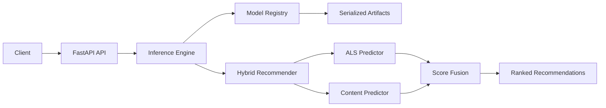

# System Architecture

## Overview

The application serves e-commerce recommendations through a FastAPI interface. Requests are routed to the inference layer, which loads versioned artifacts and coordinates the ALS and content models through the hybrid recommender.

## Data Flow

1. The client sends a request to the FastAPI endpoint.
2. The inference engine retrieves cached model objects and mappings from the model registry.
3. ALS produces collaborative candidates from user-item latent factors.
4. The content model produces similarity-based candidates from TF-IDF item representations.
5. The hybrid layer normalizes and fuses available scores, then ranks the final items.
6. For unknown users or unavailable candidates, the API returns the precomputed popular-item fallback.

## Components

- **FastAPI (`api/`)**: validates requests, exposes REST endpoints, and returns typed responses.
- **Inference (`src/inference/`)**: coordinates artifact loading and recommendation serving.
- **Models (`src/models/`)**: contains frozen ALS, content, and hybrid implementations.
- **Artifacts (`artifacts/`)**: stores model factors, TF-IDF assets, hybrid weights, and fallback items.
- **Configuration (`configs/`)**: provides model paths and deployment defaults.
